# Matcha   

Dating website

## Installation

install package for client and server

```bash
npm --prefix ./server install
npm --prefix ./client install
node ./server/Config/Setup.js #generate 580 users
```

How to run client-side

```bash
cd client
#production mode
npm run startDev #OR
#development mode
npm run startProduc
```

How to run server-side

```bash
cd server
npm run start
```

## Environment Variables

create .env file inside server folder and add the following variables

```env
PORT= <port>
HOST= <host>
PROTOCOL= <protocol>
CLIENT_PORT= <port>
CLIENT_HOST= <host>
CLIENT_PROTOCOL= <protocol>
MYSQL_HOST= <host>
MYSQL_PORT= <port>
MYSQL_USER= <user>
MYSQL_PASSWORD= <password>
MYSQL_DATABASE= <database>
opencagedata_API_KEY= <key>
NODEMAILER_EMAIL= <email>
NODEMAILER_PASS= <password>
JWT_KEY= <key>
```

## Screenshots

Home Dark/Light mode</br>
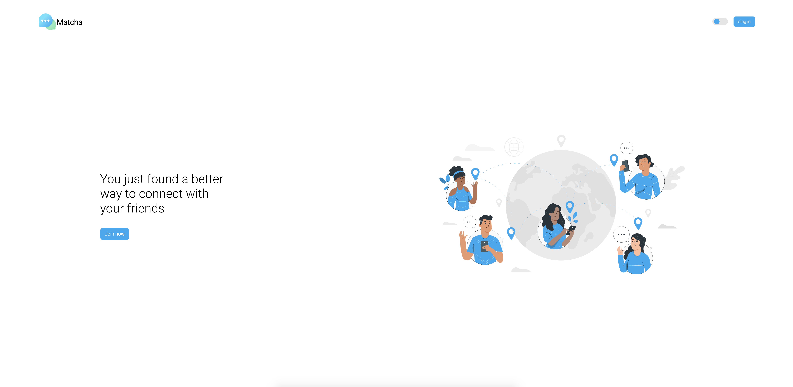</br>
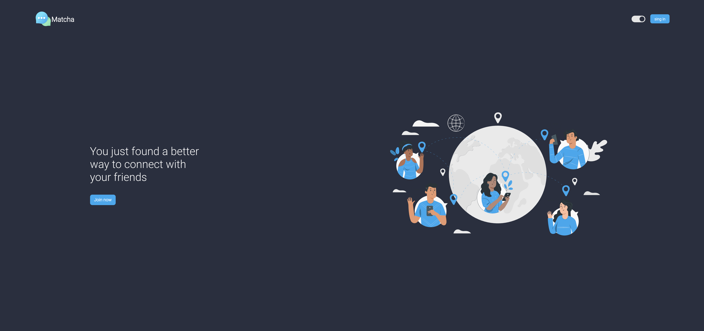</br>
SignIn Dark/Light mode</br>
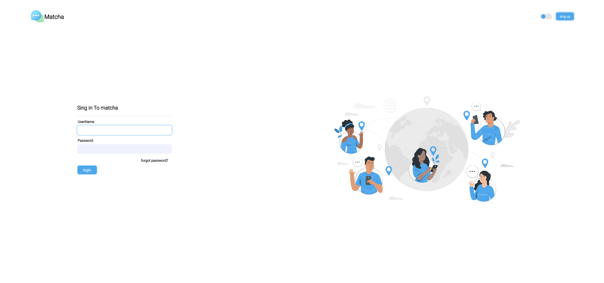</br>
</br>
SignUp Dark/Light mode</br>
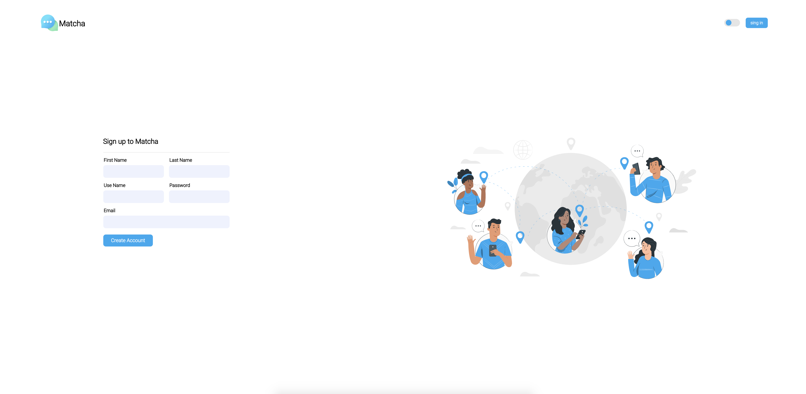</br>
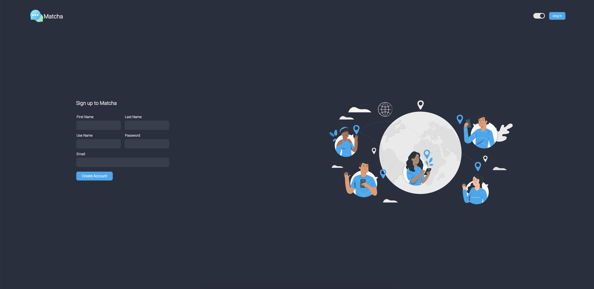</br>
Dashboard Dark/Light mode</br>
</br>
</br>
Profile Dark/Light mode</br>
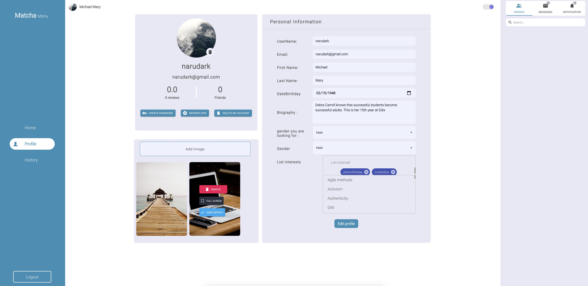</br>
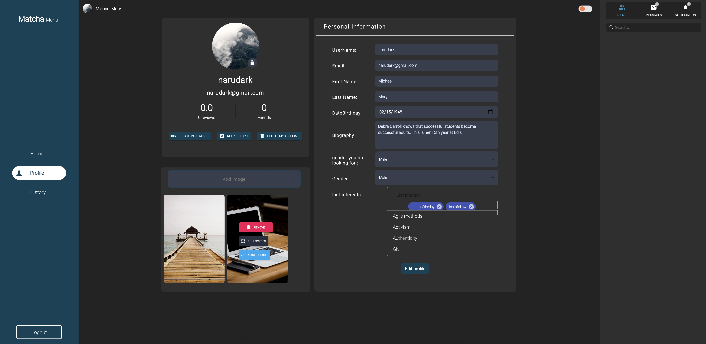</br>
History Dark/Light mode</br>
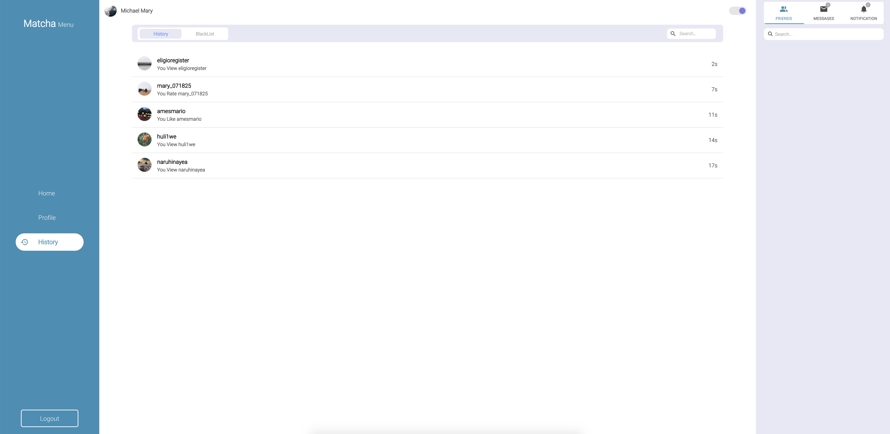</br>
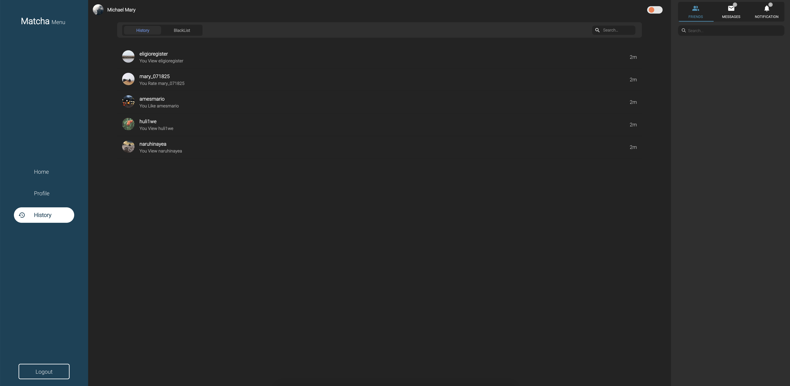</br>
Steps</br>
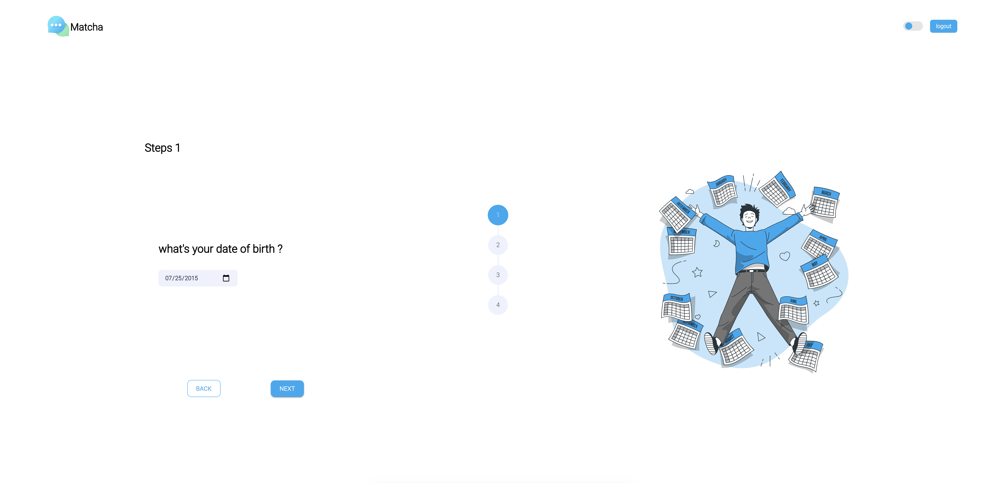</br>
</br>
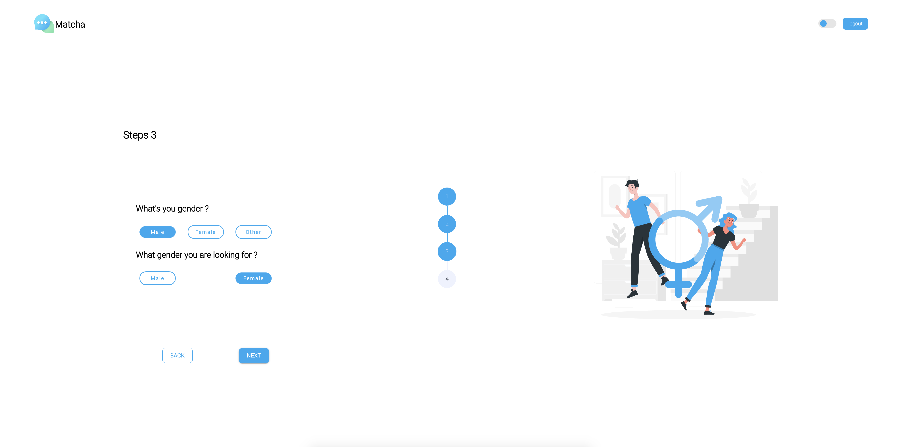</br>
